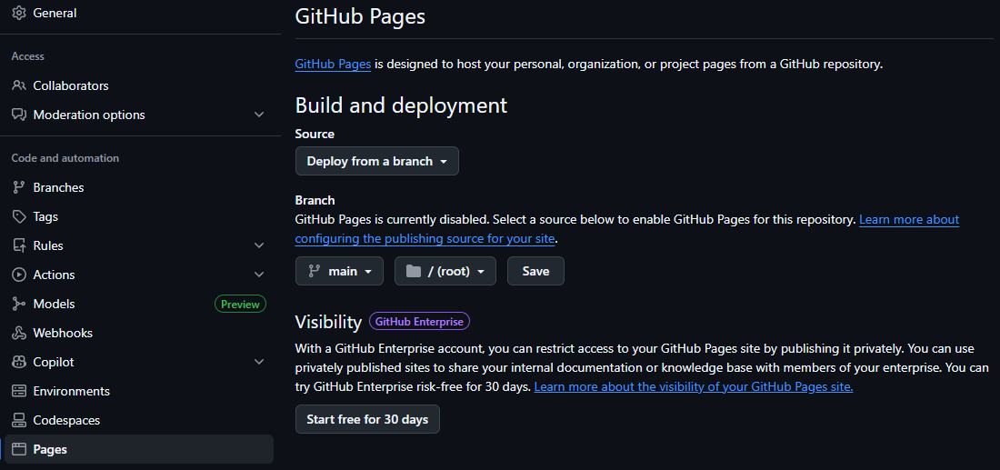
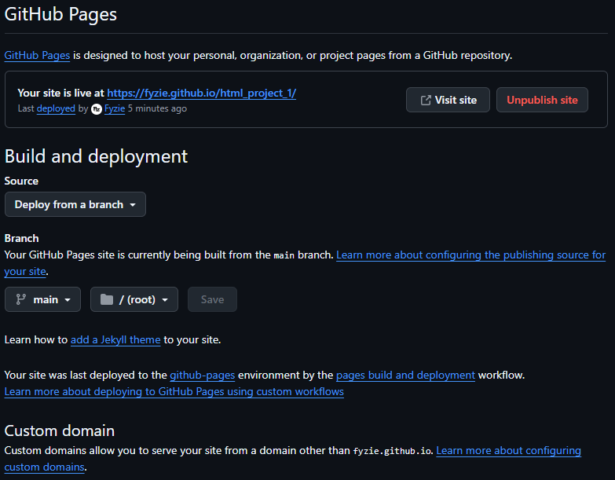

# How to Host Website on Github

1. Upload your html folders into the github repo.
2. Make sure that the main html page named index (e.g. index.html).
3. Go to repo "settings", proceed to "pages", and configure as below:

4. Save the changes, refresh the github webpage and the webpage link will appear as follows:

